# Hi there, I'm Ramm 👋


### 💻 Full-Stack Developer • Lifelong Learner

I'm a developer who enjoys building **modern web applications** and turning ideas into functional products.

I love learning through real-world projects, solving problems, and continuously improving my development skills.

---

## 🧑‍💻 About Me

* 🚀 Focused on **Full-Stack Web Development**
* 🌐 Building modern web applications with **Next.js**
* ⚙️ Developing backend applications with **NestJS**
* 🗄️ Working with **PostgreSQL, MySQL & Prisma**
* 🎨 Creating clean and responsive interfaces with **Tailwind CSS**
* 🐳 Using **Docker** for development and application environments
* 🧠 Learning by building real-world projects
* 📍 Indonesia 🇮🇩

---

## ⚡ Tech Stack

### Frontend

<p>
  
</p>

### Backend & Database

<p>
  
</p>

### Tools

<p>
  
</p>

---

## 🛠️ What I Build

```text
🌐 Web Applications
⚙️ REST APIs
🔐 Authentication & Authorization
🗄️ Database-driven Applications
📦 CRUD Systems
🐳 Containerized Applications
🚀 Full-Stack Applications
```

---

## 🚀 Currently Learning

```text
Next.js        ███████████████████░  95%
NestJS         ██████████████████░░  90%
TypeScript     █████████████████░░░  85%
Tailwind CSS   █████████████████░░░  85%
PostgreSQL     ███████████████░░░░░  75%
MySQL          ███████████████░░░░░  75%
Prisma         ███████████████░░░░░  75%
Docker         █████████████░░░░░░░  70%
```

---

## 📂 What I'm Working On

### 🌐 Full-Stack Web Development

Building modern web applications using:

**Next.js + TypeScript + Tailwind CSS**

### ⚙️ Backend Development

Developing backend systems and REST APIs using:

**NestJS + Prisma + PostgreSQL / MySQL**

### 🐳 Development Environment

Using:

**Docker + Git + GitHub**

to manage development environments and projects.

---

## 📊 GitHub Stats

<p align="center">
  
  
</p>

---

## 🔥 Contribution Streak

<p align="center">
  
</p>

---

## 🎯 My Journey

```text
🌱 Learn
   ↓
💻 Build
   ↓
🧩 Solve Problems
   ↓
🚀 Improve
   ↓
👨‍💻 Repeat
```

---

## 💡 Developer Philosophy

> **"Build. Break. Learn. Improve. Repeat."**

I believe the best way to learn programming is by **building real projects**, solving problems, learning from mistakes, and continuously improving.

---

## 🤝 Let's Connect

<p align="center">
  <a href="https://github.com/rammdev29">
    
  </a>
</p>

---

<p align="center">
  
</p>

<p align="center">
  <b>Thanks for visiting my profile! 🚀</b>
</p>

###

<picture>
  <source
    media="(prefers-color-scheme: dark)"
    srcset="https://raw.githubusercontent.com/rammdev29/rammdev29/pacman-output/pacman-contribution-graph-dark.svg?game=pacman"
  />
  <source
    media="(prefers-color-scheme: light)"
    srcset="https://raw.githubusercontent.com/rammdev29/rammdev29/pacman-output/pacman-contribution-graph.svg?game=pacman"
  />
  
</picture>

###